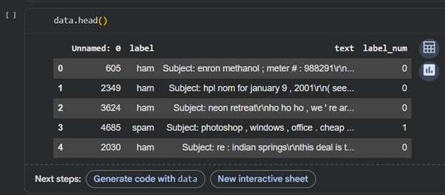

# Detecting-Spam-Emails-using-tensorflow-in-python
This is one of my first model in which i have used a combo and variation of many techniques to fine tune a model in 20 epochs in order to detect spam emails. This model and technique is varifired and can be used on SMS and other platform messages too. including Slack. 

   
